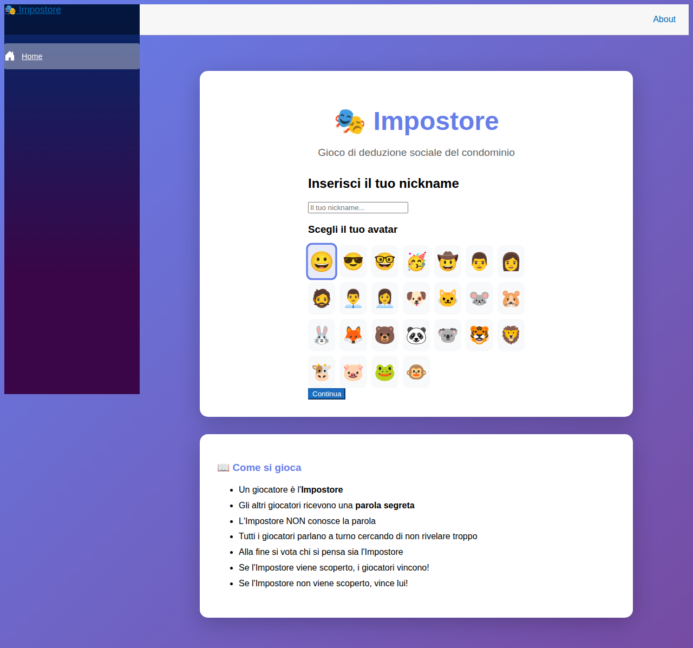
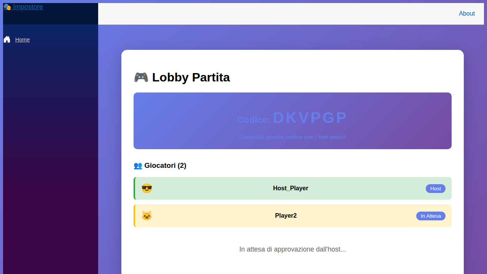
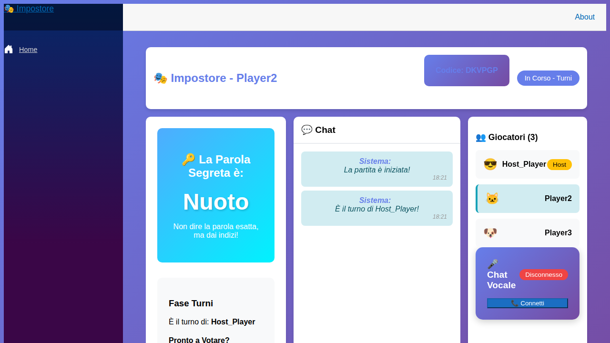
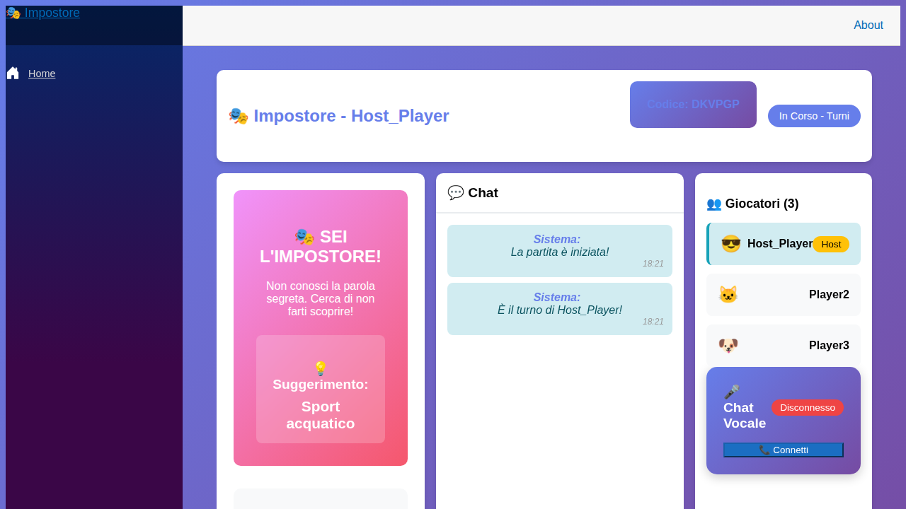
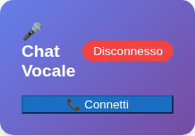

# 🎭 Guida Rapida - Impostore

Una guida veloce per iniziare a giocare a Impostore in pochi minuti!

---

## 🚀 Inizia Subito

### 1️⃣ Crea o Unisciti a una Partita

**Per creare una partita:**
1. Inserisci il tuo nickname
2. Scegli un avatar
3. Clicca "Continua"
4. Inserisci la password: `deamicis2026`
5. Clicca "🎮 Crea Partita"
6. Condividi il codice con gli amici!

**Per unirti:**
1. Inserisci il tuo nickname
2. Scegli un avatar  
3. Clicca "Continua"
4. Inserisci il codice partita
5. Clicca "🚪 Unisciti alla Partita"

---

### 2️⃣ Lobby - Attendi i Giocatori

- **Host**: Approva i giocatori che richiedono di entrare
- **Giocatori**: Aspetta l'approvazione dell'host
- **Minimo 3 giocatori** necessari per iniziare
- L'host clicca "🚀 Inizia Partita" quando pronti

---

### 3️⃣ Gioca! - Due Ruoli Diversi

#### 🔑 Sei un Giocatore Normale?

✅ **Obiettivo**: Scoprire l'impostore!

**Cosa fare:**
1. Ricevi una **parola segreta** (es: "Nuoto")
2. Durante i turni, dai **indizi** senza dire la parola esatta
3. **Osserva** chi dà indizi strani o vaghi
4. **Vota** chi pensi sia l'impostore
5. **Vinci** se l'impostore viene scoperto!

**Esempio di indizi per "Nuoto":**
- ✅ "Si fa in acqua"
- ✅ "È uno sport olimpico"
- ❌ "È il nuoto" (troppo ovvio!)

---

#### 🎭 Sei l'Impostore?

🎭 **Obiettivo**: Non farti scoprire!

**Cosa fare:**
1. **NON** ricevi la parola segreta
2. Ricevi solo un **suggerimento** (es: "Sport acquatico")
3. Dai indizi **credibili** basati sul suggerimento
4. **Ascolta** gli altri per capire la parola
5. **Vota** qualcun altro
6. **Vinci** se NON sei il più votato!

**Esempio di indizi con suggerimento "Sport acquatico":**
- ✅ "Serve molta resistenza"
- ✅ "Si fa in estate"
- ✅ "È rinfrescante"

---

### 4️⃣ Chat Vocale (Opzionale)

1. Clicca "📞 Connetti"
2. Permetti l'accesso al microfono
3. Parla con gli altri giocatori in tempo reale!
4. Clicca il microfono per attivare/disattivare

---

## 🎯 Fasi di Gioco

1. **Lobby** → Attesa giocatori
2. **Turni** → Ogni giocatore parla a turno
3. **Discussione** → Tutti parlano liberamente
4. **Votazione** → Tutti votano l'impostore sospetto
5. **Risultati** → Chi ha vinto?

---

## 💡 Consigli Rapidi

### Per Tutti
- 🎤 Usa la chat vocale per discussioni naturali
- 👀 Osserva attentamente gli indizi degli altri
- 🤔 Non avere fretta di votare

### Per Giocatori Normali
- Dai indizi chiari ma non troppo ovvi
- Collabora senza rivelare troppo
- Cerca contraddizioni negli indizi

### Per l'Impostore
- Ascolta prima di parlare
- Adatta i tuoi indizi man mano che capisci la parola
- Sii naturale, non sembrare nervoso!

---

## 📖 Documentazione Completa

Per istruzioni dettagliate, consulta il **[Manuale Utente Completo](MANUALE_UTENTE.md)** che include:
- Spiegazioni dettagliate di ogni fase
- Strategie avanzate
- Risoluzione problemi
- Configurazione chat vocale
- E molto altro!

---

## 🎉 Buon Divertimento!

Ora sei pronto per giocare! Ricorda:
- **Comunicazione** è la chiave
- **Osservazione** ti aiuta a vincere  
- **Divertimento** è l'obiettivo principale

**Che vinca il migliore! 🎭🎮**
