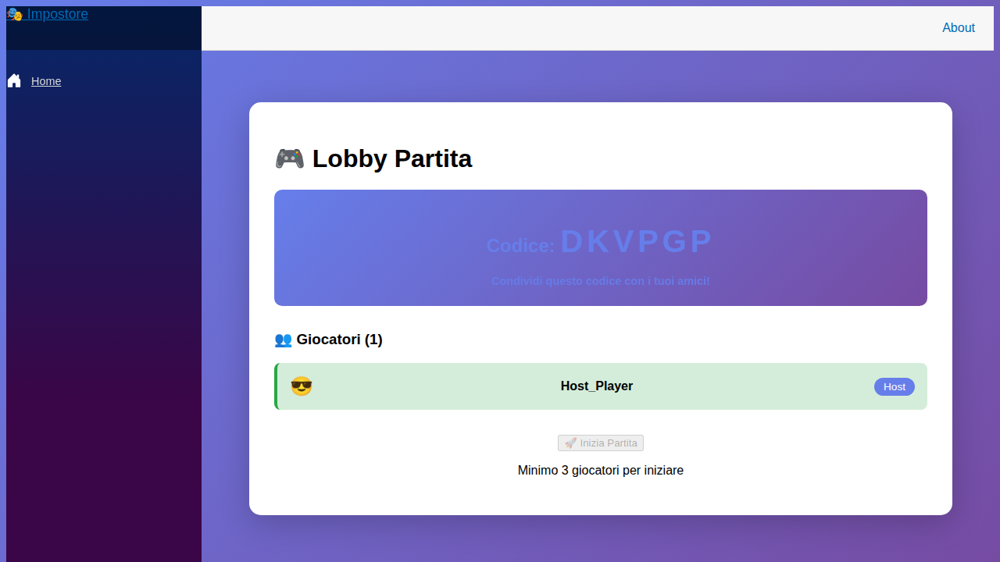

# 📖 MANUALE UTENTE - Impostore

## Benvenuto in Impostore! 🎭

Questo è il manuale utente completo per giocare a Impostore, il gioco di deduzione sociale in tempo reale. Qui troverai tutte le istruzioni necessarie sia che tu sia un **Giocatore Normale** che un **Impostore**.

---

## 📋 Indice

1. [Come Iniziare](#come-iniziare)
2. [Creare una Partita](#creare-una-partita)
3. [Unirsi a una Partita](#unirsi-a-una-partita)
4. [Come Giocare - Giocatore Normale](#come-giocare---giocatore-normale)
5. [Come Giocare - Impostore](#come-giocare---impostore)
6. [Fasi di Gioco](#fasi-di-gioco)
7. [Consigli e Strategie](#consigli-e-strategie)
8. [Risoluzione Problemi](#risoluzione-problemi)

---

## 🚀 Come Iniziare

### Requisiti
- Un browser moderno (Chrome, Firefox, Safari, Edge)
- Connessione internet

### Primo Accesso
1. Apri l'applicazione nel tuo browser
2. Vedrai la **Homepage** con un campo per inserire il tuo nickname
3. Inserisci il tuo nickname (sarà visibile agli altri giocatori)
4. Scegli se **Creare una Partita** o **Unirti a una Partita**

---

## 🎮 Creare una Partita

### Passo 1: Diventa l'Host
1. Dalla homepage, inserisci il tuo **nickname**
2. Clicca sul pulsante **"🎮 Crea Partita"**
3. Inserisci la **password di creazione** (richiesta per creare partite)
4. Il sistema genererà un **codice partita univoco** (es: DOJG9G)

### Passo 2: Condividi il Codice
1. Condividi il codice partita con i tuoi amici
2. Possono unirsi inserendo il codice nella homepage

### Passo 3: Approva i Giocatori
1. Quando un giocatore richiede di entrare, riceverai una notifica
2. Come host, vedrai i pulsanti **✅ Accetta** e **❌ Rifiuta**
3. Approva i giocatori che vuoi nella partita
4. **Minimo 3 giocatori approvati** necessari per iniziare

### Passo 4: Inizia la Partita
1. Quando hai almeno 3 giocatori approvati
2. Clicca sul pulsante **"🚀 Inizia Partita"**
3. Il gioco assegnerà automaticamente i ruoli

---

## 👥 Unirsi a una Partita

### Passo 1: Inserisci il Codice
1. Dalla homepage, inserisci il tuo **nickname**
2. Clicca sul pulsante **"🎯 Unisciti"**
3. Inserisci il **codice partita** ricevuto dall'host

### Passo 2: Attendi l'Approvazione
1. Verrai aggiunto alla **lista in attesa**
2. Vedrai il messaggio "In attesa di approvazione..."
3. L'host deve approvarti per giocare

### Passo 3: Entra nel Gioco
1. Quando l'host ti approva, entrerai nella **lobby**
2. Vedrai tutti i giocatori approvati e in attesa
3. Aspetta che l'host avvii la partita

---

## 🎯 Come Giocare - Giocatore Normale

### Il Tuo Ruolo
Come **Giocatore Normale**, il tuo obiettivo è:
- ✅ **Scoprire chi è l'impostore**
- ✅ **Dare indizi credibili** sulla parola segreta
- ✅ **Osservare** gli altri giocatori per trovare comportamenti sospetti

### Cosa Ricevi
Quando la partita inizia, vedrai:
- 🔑 **La Parola Segreta** (es: "Gatto")
- 📝 **Istruzioni**: "Non dire la parola esatta, ma dai indizi!"

### Fase Turni
Durante la **Fase Turni**:
1. I giocatori parlano uno alla volta
2. Quando è il **tuo turno**:
   - La chat si attiverà automaticamente
   - Scrivi un messaggio con un indizio sulla parola
   - **Esempio**: Per "Gatto" → "Ha quattro zampe e fa le fusa"
3. Quando non è il tuo turno:
   - Puoi solo leggere i messaggi degli altri
   - Osserva attentamente chi dà indizi vaghi o strani

### Cosa Dire
✅ **Buoni indizi**:
- "Vive in casa con le persone" (per Gatto)
- "Si mangia con le mani" (per Pizza)
- "Si gioca con una palla" (per Calcio)

❌ **Evita**:
- Non dire la parola esatta: "È un gatto!" ❌
- Non essere troppo vago: "È una cosa" ❌
- Non essere troppo specifico da permettere all'impostore di capire subito

### Pronto a Votare
1. Quando sei pronto per votare, clicca **"✋ Sono Pronto a Votare"**
2. Il tuo stato cambierà da ⏳ a ✓
3. Quando **tutti** sono pronti, inizia la votazione automaticamente

### Fase Votazione
1. Seleziona dal menu a tendina **chi pensi sia l'impostore**
2. Clicca **"🗳️ Vota"**
3. Attendi che tutti votino

### Vittoria
🎉 **Vinci se**: L'impostore è il giocatore più votato!

> **Nota**: Screenshot della vittoria sarà aggiunto in un prossimo aggiornamento.

---

## 🎭 Come Giocare - Impostore

### Il Tuo Ruolo
Come **Impostore**, il tuo obiettivo è:
- 🎯 **Non farti scoprire** dagli altri giocatori
- 🕵️ **Dedurre la parola segreta** ascoltando gli indizi degli altri
- 🎭 **Fingerti un giocatore normale** dando indizi credibili

### Cosa Ricevi
Quando la partita inizia, vedrai:
- 🎭 **Badge "SEI L'IMPOSTORE!"** (visibile solo a te)
- 💡 **Un Suggerimento/Categoria** (es: "Animale domestico")
- ❌ **NON conosci la parola segreta esatta**

### Fase Turni
Durante la **Fase Turni**:
1. Quando è il **tuo turno**:
   - Usa il **suggerimento** per dare indizi credibili
   - **Esempio**: Suggerimento "Animale domestico" → "Vive con le famiglie"
   - Questo indizio va bene per gatto, cane, criceto, ecc.
2. **Ascolta attentamente** gli indizi degli altri
3. Cerca di **dedurre la parola segreta** dagli indizi

### Strategie per Non Farti Scoprire
✅ **Cosa fare**:
- Dai indizi **abbastanza generici** da essere credibili
- **Adatta** i tuoi indizi man mano che capisci la parola
- **Bilanciare**: non essere troppo vago, né troppo specifico
- **Esempio buono**: "Ha quattro zampe" (per Gatto, se hai capito dagli altri)

❌ **Cosa evitare**:
- Non essere troppo generico: "È una cosa che esiste" ❌
- Non contraddire gli altri: Se tutti parlano di animali, non parlare di cibo ❌
- Non farti prendere dal panico se non capisci subito la parola

### Esempi di Indizi da Impostore
**Suggerimento: "Animale domestico"**
- "Puoi accarezzarlo" ✅
- "Le persone lo tengono in casa" ✅
- "È soffice" ✅ (se gli altri hanno parlato di pelo)

**Suggerimento: "Sport con palla"**
- "Si gioca in squadra" ✅
- "Serve una palla" ✅
- "È molto popolare" ✅

### Fase Votazione
1. Cerca di **votare qualcun altro** che sembrava sospetto
2. Se hai capito la parola, puoi dare un ultimo indizio nella chat per sembrare innocente
3. **Sii convincente** fino alla fine!

### Vittoria
🎭 **Vinci se**: NON sei il giocatore più votato!

> **Nota**: Screenshot della vittoria sarà aggiunto in un prossimo aggiornamento.

---

---

## 📊 Fasi di Gioco

### 1. Lobby (In Attesa)
- L'host approva i giocatori
- Minimo 3 giocatori per iniziare
- Chat disabilitata

### 2. Starting (Inizializzazione)
- Assegnazione ruoli (Impostore o Giocatore Normale)
- Selezione parola segreta
- Breve transizione

### 3. InProgress (Fase Turni)
- I giocatori danno indizi uno alla volta
- Chat attiva per tutti (miglioramento dalla versione originale)
- Possibilità di dichiarare "Pronto a Votare"
- Host può passare al turno successivo o avviare la votazione

### 4. Voting (Votazione)
- Tutti votano contemporaneamente
- Seleziona chi pensi sia l'impostore
- Chat attiva per discussioni finali

### 5. Finished (Finita)
- Risultati della votazione
- Rivelazione dell'impostore
- Opzione **"🔄 Nuova Partita"** (solo per l'host)

---

## 💡 Consigli e Strategie

### Per Tutti i Giocatori
1. **Osserva attentamente**: Chi dà indizi vaghi? Chi si contraddice?
2. **Non avere fretta**: Prenditi il tempo necessario per capire
3. **Divertiti**: È un gioco sociale, l'obiettivo è divertirsi insieme!

### Per i Giocatori Normali
1. **Collabora senza rivelare troppo**: Indizi chiari ma non ovvi
2. **Attenzione alle contraddizioni**: Se due giocatori danno indizi incompatibili, uno potrebbe essere l'impostore
3. **Non fidarti troppo presto**: L'impostore può essere convincente!

### Per l'Impostore
1. **Ascolta prima di parlare**: Raccogli informazioni dagli altri
2. **Adatta i tuoi indizi**: Quando capisci la parola, dai indizi più specifici
3. **Sii naturale**: Non sembrare nervoso o troppo silenzioso
4. **Crea dubbi**: Se possibile, porta l'attenzione su altri giocatori

---

## 🔧 Risoluzione Problemi

### Non riesco a connettermi alla partita
- **Verifica il codice**: Assicurati di aver inserito il codice corretto
- **Attendi approvazione**: L'host deve approvarti prima che tu possa giocare
- **Aggiorna la pagina**: A volte un refresh risolve problemi di connessione

### La chat non funziona
- **Verifica lo stato**: Controlla che la partita sia nella fase giusta (InProgress o Voting)
- **Aspetta il tuo turno**: Durante la fase turni, puoi scrivere in qualsiasi momento (chat sempre attiva)
- **Aggiorna**: Se il problema persiste, ricarica la pagina

### La partita si è bloccata
- **Aggiorna la pagina**: SignalR gestirà la riconnessione automatica
- **Verifica la connessione**: Assicurati di avere una connessione internet stabile
- **Contatta l'host**: L'host può avviare una nuova partita con rematch

### Non vedo il pulsante "Inizia Partita"
- **Solo l'host** può vedere e usare questo pulsante
- **Minimo 3 giocatori** approvati necessari
- Se sei l'host e non lo vedi, verifica di avere abbastanza giocatori

---

## 🎉 Buon Divertimento!

Ora sei pronto per giocare a Impostore! Ricorda:
- **Comunicazione** è la chiave
- **Osservazione** ti aiuta a vincere
- **Divertimento** è l'obiettivo principale

Che tu sia un giocatore normale o l'impostore, che vinca il migliore! 🎭🎮

---

## 📞 Supporto

Per problemi, domande o suggerimenti:
- Apri un **issue** su GitHub
- Contatta gli sviluppatori del progetto

**Versione**: 1.2.0  
**Ultimo aggiornamento**: Gennaio 2026
